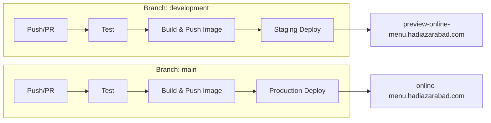

# Online Menu System

**Django** · **Python** · **HTML** · **CSS** · **JavaScript** · **API** · **Django REST Framework**

A full-stack online menu system that serves both a **template-rendered frontend** (HTML, CSS, JavaScript via Django templates) and a **REST API** for integration. Built with Django and Django REST Framework, it is suitable for restaurants, cafes, and food establishments that need a digital menu and an API for third-party or custom frontends.

---

## Live Application

| Environment | URL |
|------------|-----|
| **Production** | [online-menu.hadiazarabad.com](https://online-menu.hadiazarabad.com) |
| **Admin panel** | [online-menu.hadiazarabad.com/admin/](https://online-menu.hadiazarabad.com/admin/) |

The admin interface is customized with image previews, inline editing for food images and toppings, and clear indicators for discounts, availability, and pricing.

**Demo access (read-only):** use username `test` and password `test` to explore the admin panel without making changes.

---

## Architecture Overview

The application is **dual-purpose**:

- **Frontend (Django templates):** Server-rendered HTML with dedicated CSS and JavaScript for a responsive, interactive menu (dark theme, glassmorphism, modal details, scroll-based animations).
- **Backend API:** RESTful API (Django REST Framework) for categories, foods, and toppings—with filtering, search, pagination, and Swagger/ReDoc documentation for integration and headless use.

Both the web UI and the API are served by the same Django project.

---

## Features

### Core Functionality
- **Category-based menu** — Organize items by categories with optional icons
- **Food details** — Descriptions, multiple images, pricing, and optional toppings
- **Topping system** — Toppings with their own pricing and availability
- **Discounts** — Percentage-based discounts on foods and toppings
- **Time-based availability** — Optional time windows per item
- **Availability status** — Per-item availability with visual cues

### User Interface
- Responsive layout (desktop, tablet, mobile)
- Modal-based food details (no full-page navigation)
- Real-time display of discounted prices and badges
- Euro (€) currency
- Clear separation of HTML, CSS, and JavaScript

### API & Integration
- REST API (Django REST Framework)
- Swagger UI and ReDoc
- Filtering (category, availability), search, pagination
- CORS configured for frontend integration


### Admin Panel
- Customized Django admin with image previews and rich display
- Inline editing for food images and toppings
- Filtering and search across models


---

## Tech Stack & Practices

- **Backend:** Django, Django REST Framework  
- **Frontend:** Django templates, HTML, CSS, JavaScript  
- **Database:** PostgreSQL  
- **Deployment:** Docker, GitHub Actions, Dokploy on Ubuntu  

The codebase follows:

- **SOLID** and **Separation of Concerns (SoC)** — Distinct layers for models, views, serializers, and templates
- **Fat models, thin views** — Business logic and domain rules live in models and utilities; views stay thin and delegate to them
- **OOP-focused design** — Structured for maintainability, testability, and teamwork

---

## CI/CD Pipeline

The project uses **two fully automated pipelines** (GitHub Actions), with tests and Docker builds running on Ubuntu.

| Branch        | Environment | Deploy target                          |
|---------------|-------------|----------------------------------------|
| `development` | Staging     | [preview-online-menu.hadiazarabad.com](https://preview-online-menu.hadiazarabad.com) |
| `main`        | Production  | [online-menu.hadiazarabad.com](https://online-menu.hadiazarabad.com)                |

**Flow:**

1. **Test job** — Install deps, run migrations check, run full test suite (PostgreSQL service).
2. **Build job** (only on push to the branch) — Build Docker image, push to Docker Hub (tags: `latest` and commit SHA).
3. **Deploy** — Handled by Dokploy on Ubuntu (pulls the new image and updates the running service).



### GitHub Actions setup

1. In the repository, add secrets:
   - `DOCKER_USERNAME` — Docker Hub username
   - `DOCKER_PASSWORD` — Docker Hub password or access token

2. On **push** to `development` or `main`: tests run, then the image is built and pushed.  
3. On **pull requests**: only tests run (no build/push).

---

## Getting Started

### Prerequisites

- Python 3.12+
- pip
- Virtual environment (recommended)
- Docker and Docker Compose (optional)

### Local development

1. **Clone the repository**
   ```bash
   git clone git@github.com:hadiazarabad/online-menu.git
   cd online-menu
   ```

2. **Create and activate a virtual environment**
   ```bash
   python -m venv .venv
   source .venv/bin/activate   # Windows: .venv\Scripts\activate
   ```

3. **Install dependencies**
   ```bash
   pip install -r requirements.txt
   ```

4. **Environment configuration**  
   Use the provided template: fill in the values in `sample.env`, then rename it to `.env` so the application can load it:
   ```bash
   cp sample.env .env
   # Edit .env with your values (SECRET_KEY, ALLOWED_HOSTS, DB_*, etc.), then save.
   # The app reads from .env at runtime.
   ```
   For local use, set at least: `SECRET_KEY`, `ALLOWED_HOSTS` (e.g. `127.0.0.1,localhost`), and database variables (`DB_ENGINE`, `DB_NAME`, `DB_USER`, `DB_PASSWORD`, `DB_HOST`, `DB_PORT`). Keep `USE_S3_STORAGE=False` unless you configure S3.

5. **Migrations**
   ```bash
   python manage.py makemigrations
   python manage.py migrate
   ```

6. **Create superuser (optional)**
   ```bash
   python manage.py createsuperuser
   ```

7. **Static files**
   ```bash
   python manage.py collectstatic
   ```

8. **Run the server**
   ```bash
   python manage.py runserver
   ```

9. **Access**
   - Web UI: http://127.0.0.1:8000/
   - Admin: http://127.0.0.1:8000/admin/
   - API docs: http://127.0.0.1:8000/redoc/

---

## Optional: S3 (or S3-compatible) storage

For production, media and static files can be served from **AWS S3** or an **S3-compatible** service (e.g. MinIO).

### Why use S3 (or compatible)?

- **Scalability** — No local disk limits; handles traffic spikes better.
- **Durability & availability** — Replication and high availability.
- **CDN-friendly** — Easy to put a CDN in front of assets.
- **Separation of concerns** — App servers stay stateless; uploads and static files live in object storage.
- **Cost** — Pay for storage and transfer; often cheaper than scaling app servers for file serving.

### Setup steps

1. In `.env`, set:
   ```env
   USE_S3_STORAGE=True
   MINIO_ENDPOINT_URL=https://your-endpoint.com   # or AWS S3 endpoint
   MINIO_BUCKET_NAME=your-bucket
   MINIO_ACCESS_KEY=your-access-key
   MINIO_SECRET_KEY=your-secret-key
   REGION_NAME=your-region
   ```

2. Ensure `django-storages` and `boto3` are in `requirements.txt` (they are in this project).

3. The project includes an extra settings module that configures S3 for both **default (media)** and **staticfiles** storage when `USE_S3_STORAGE=True`. Static files use cache-control headers suitable for long-lived assets.

4. Run `python manage.py collectstatic` so static files are uploaded to S3. New media uploads (e.g. food images) will go to S3 automatically.

---

## Testing

```bash
python manage.py test
```

With Docker:

```bash
docker-compose exec web python manage.py test
```

The suite covers models (creation, relations, properties), views (templates, context), API (endpoints, serialization, filters), and utilities.

---

## Production deployment

- Set `DEBUG=False`, a strong `SECRET_KEY`, and correct `ALLOWED_HOSTS`.
- Use PostgreSQL and, if needed, S3 (or compatible) for media/static files.
- Static files are served via WhiteNoise when not using S3.
- Use HTTPS, restrict CORS, and follow standard security hardening (headers, logging, etc.).

Docker-based production runs the same image built by CI; configure Dokploy (or your orchestrator) to use the image and environment variables from `.env`/secrets.

---

## License

This project is part of a portfolio and is available for educational and demonstration purposes.
